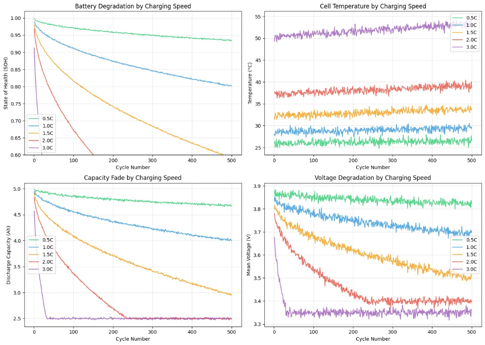
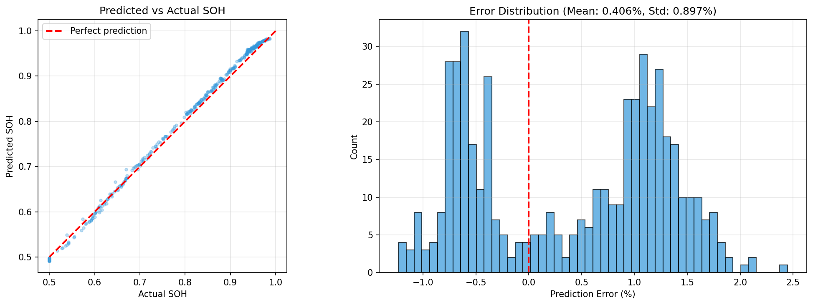
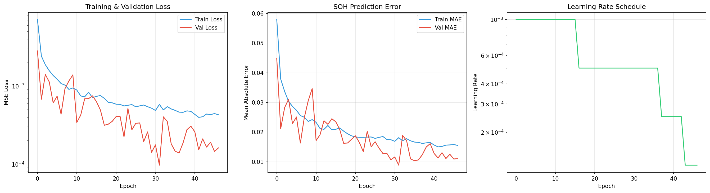

<div align="center">

# ⚡ ChargeGPT

### Agentic Battery Health Optimization using Physics-Informed Natural Law Models

[](https://python.org)
[](https://pytorch.org)
[](https://langchain.com)
[](https://streamlit.io)
[](https://ai.google.dev)

*A Physics-Informed Transformer that understands electrochemical degradation laws, paired with an agentic AI system that reasons about battery health and autonomously selects the right analysis tools.*

</div>

---

## 🧠 What is ChargeGPT?

**ChargeGPT** is an advanced **Natural Law Model (NLM)** designed to extend the lifespan of Electric Vehicle (EV) batteries. Unlike traditional Battery Management Systems (BMS) that rely on simple rule-based logic, ChargeGPT utilizes a **Physics-Informed Transformer** to understand the underlying electrochemical laws of lithium-ion degradation.

By integrating this NLM with an **agentic AI system** (LangChain ReAct + Gemini), ChargeGPT acts as a **"Battery Guardian"** — it autonomously reasons about which analysis tools to invoke, chains multiple predictions when needed, and delivers physics-backed charging recommendations. The agent has autonomous tool selection, meaning it decides *what* to analyze and *how* to interpret results without hardcoded decision logic.

### 🔑 Key Innovation

> **Traditional BMS**: *"Battery is at 80%. Slow down charging."* (Rule-based)
>
> **ChargeGPT**: *"Based on electrochemical analysis, your current 2C fast-charging pattern will degrade the SEI layer by 18% over 500 cycles. Switching to 1C overnight charging would preserve 94% SOH — extending battery life by ~3 years."* (Physics-informed reasoning)

---

## 🏗️ Architecture

```
┌──────────────────────────────────────────────────────────────────────┐
│                         ChargeGPT System                             │
│                                                                      │
│  ┌─────────────────┐   ┌──────────────────┐   ┌──────────────────┐   │
│  │  Physics-Based   │──▶│   Transformer    │◀──│  LangChain ReAct │  │
│  │  Data Generator  │   │   (NLM Brain)    │   │     Agent        │  │
│  │                  │   │                  │   │                  │  │
│  │ • Power-law      │   │ • 2-layer encoder│   │ • Gemini 2.0     │  │
│  │   capacity fade  │   │ • 4 attn heads   │   │   Flash LLM      │  │
│  │ • Arrhenius      │   │ • 76K params     │   │ • 4 Tools:       │  │
│  │   temp effects   │   │ • R² = 0.9971    │   │   predict_soh    │  │
│  │ • SEI growth     │   │ • MAE = 0.88%    │   │   compare_strat  │  │
│  │   modeling       │   │                  │   │   est_lifespan   │  │
│  │ • Joule heating  │   │                  │   │   recommend_plan │  │
│  └──────────────────┘   └──────────────────┘   └──────────────────┘  │
│                               │                                      │
│                               ▼                                      │
│                  ┌────────────────────────┐                          │
│                  │   Streamlit Dashboard   │                         │
│                  │     (Dark Theme)        │                         │
│                  │                        │                          │
│                  │ • Health Predictor     │                          │
│                  │ • Strategy Comparison  │                          │
│                  │ • Lifespan Estimator   │                          │
│                  │ • AI Assistant Chat    │                          │
│                  └────────────────────────┘                          │
└──────────────────────────────────────────────────────────────────────┘
```

---

## ⚙️ How It Works

### Phase 1: Physics-Based Data Generation

We generate synthetic battery cycling data using **empirical electrochemical models** grounded in real physics:

| Model | Equation | What It Captures |
|-------|----------|-----------------|
| **Power-law capacity fade** | `SOH = 1 - k × √N` | SEI layer growth follows square-root of cycle count |
| **C-rate stress** | `k ∝ C_rate^1.5` | Higher charging speeds cause exponentially more damage |
| **Arrhenius temperature** | `k ∝ exp(Ea/RT)` | Every 10°C rise roughly doubles degradation rate |
| **Joule heating** | `ΔT ∝ C_rate^1.8` | Fast charging generates more internal heat |

**Dataset**: 2,500 cycles across 5 C-rates (0.5C → 3.0C), with 6 features per cycle:
- `voltage_mean` — Average cell voltage
- `voltage_std` — Voltage variability (increases with degradation)
- `current_mean` — Charging current (C-rate × capacity × SOH)
- `temperature` — Cell temperature (Joule heating + aging)
- `discharge_capacity` — Remaining usable capacity
- `c_rate` — Charging speed

<div align="center">



*Synthetic degradation curves showing realistic physics: 3C charging degrades 8× faster than 0.5C*

</div>

### Phase 2: Transformer Model (The NLM)

A compact **Transformer Encoder** (`model.py`) learns the degradation laws from data:

| Component | Specification |
|-----------|--------------|
| Architecture | Transformer Encoder (PyTorch `nn.TransformerEncoder`) |
| Input | Sliding window of 10 consecutive cycles (6 features each) |
| Input Projection | Linear(6 → 64) |
| Positional Encoding | Learned embeddings (`nn.Embedding`) |
| Encoder Layers | 2 |
| Attention Heads | 4 |
| Hidden Dimension | 64 |
| Feedforward Dim | 128 |
| Activation | GELU |
| Pooling | Global Average Pooling across sequence |
| Prediction Head | MLP: Linear(64→32) → GELU → Dropout → Linear(32→1) → Sigmoid |
| Output | SOH prediction ∈ [0, 1] |
| Parameters | **76,033** |

**Why a Transformer?** The self-attention mechanism identifies *which past cycles* contributed most to current degradation — a single high-stress cycle causes disproportionate damage, and attention captures this naturally.

### Phase 3: Agentic AI System (ReAct Pattern)

A **LangChain ReAct agent** (`agent.py`) powered by **Google Gemini 2.0 Flash** uses the trained Transformer as a tool. The agent autonomously decides which tools to invoke based on the user's question:

1. User asks: *"Should I fast charge my EV daily?"*
2. Agent **reasons** → decides to call `predict_soh(c_rate=3.0, cycles=500)`
3. Transformer predicts: SOH = 49%
4. Agent **autonomously chains** another call: `predict_soh(c_rate=1.0, cycles=500)` → SOH = 86%
5. Agent **synthesizes** a physics-backed recommendation with actionable advice

> **What makes it agentic?** The agent has 4 tools available and independently decides which to use (or combine) based on the query. It performs multi-step reasoning — Reason → Act → Observe → Reason — without any hardcoded routing logic.

#### Agent Tools

| Tool | Purpose | Example Input |
|------|---------|--------------|
| `predict_soh` | Predict SOH for a given C-rate and cycle count | `c_rate=2.0, num_cycles=300` |
| `compare_strategies` | Compare multiple C-rates side by side | `c_rates="0.5,1.0,2.0,3.0", num_cycles=300` |
| `estimate_lifespan` | Estimate cycles/years until battery hits a target SOH | `c_rate=1.0, target_soh=0.8` |
| `recommend_plan` | Generate a weekly charging schedule based on driving habits | `daily_km=80, battery_kwh=60` |

### Phase 4: Interactive Dashboard

A **Streamlit dashboard** (`app.py`) with a professional **dark theme** provides 4 pages:

| Page | What It Shows |
|------|--------------|
| **Health Predictor** | SOH gauge, capacity loss metrics. Adjust C-rate and cycle count with sliders. |
| **Strategy Comparison** | Degradation curves for multiple C-rates overlaid on one chart. Bar chart comparing SOH at a specific cycle snapshot. |
| **Lifespan Estimator** | Binary-search to find how many cycles until battery reaches target SOH. Bar chart comparing lifespan across all C-rates. |
| **AI Assistant** | Chat interface powered by the ReAct agent. Example query buttons. Full conversational interaction with tool-backed answers. |

**Dashboard features:**
- Dark theme enforced via `.streamlit/config.toml` and custom CSS
- Plotly charts with dark backgrounds, styled axes, and hover labels
- Responsive layout with metric cards, section dividers, and Inter font
- Real-time SOH predictions from the trained Transformer model

---

## 📊 Model Performance

<div align="center">

| Metric | Value | Interpretation |
|--------|-------|----------------|
| **MAE** | **0.88%** | Average prediction error less than 1% |
| **RMSE** | 0.98% | Root mean squared error |
| **R² Score** | **0.9971** | Explains 99.7% of variance |
| **MSE** | 0.0001 | Near-zero mean squared error |



*Left: Predicted vs Actual SOH (tight alignment). Right: Error distribution centered near zero.*



*Training converges in ~45 epochs with LR scheduling and early stopping.*

</div>

---

## 📂 Project Structure

```
chargeGPT/
├── .streamlit/
│   └── config.toml                # Dark theme configuration
├── reference/
│   ├── generate_data_colab.py     # Physics-based data generation (Colab)
│   ├── train_model_colab.py       # Transformer training pipeline (Colab)
│   └── benchmark.py               # Model benchmarking script
├── data/
│   └── battery_data.csv           # 2,500 cycles of synthetic battery data
├── models/
│   ├── chargegpt_model.pth        # Trained Transformer weights (318 KB)
│   ├── scaler.pkl                 # MinMaxScaler for feature normalization
│   ├── model_config.json          # Architecture config + training metrics
│   ├── data_preview.png           # Physics-based degradation curves
│   ├── prediction_results.png     # Predicted vs Actual SOH plot
│   └── training_history.png       # Loss/MAE convergence curves
├── model.py                       # ChargeGPTModel class (Transformer Encoder)
├── agent.py                       # LangChain ReAct agent with 4 tools
├── app.py                         # Streamlit dark-themed dashboard (4 pages)
├── .env                           # GEMINI_API_KEY (not committed)
├── .gitignore                     # Git ignore rules
├── README.md                      # This file
└── requirements.txt               # Python dependencies
```

---

## 🚀 Getting Started

### Prerequisites

- Python 3.10+
- Conda (recommended) or pip
- Google Gemini API key (for the AI agent)
- Google Colab (for training, optional — pre-trained model included)

### Installation

```bash
# Clone the repository
git clone https://github.com/your-username/chargeGPT.git
cd chargeGPT

# Create conda environment (recommended)
conda create -n nlm python=3.11 -y
conda activate nlm

# Install dependencies
pip install -r requirements.txt
```

### Setup API Key

Create a `.env` file in the project root:

```bash
GEMINI_API_KEY=your-gemini-api-key-here
```

### Run the Dashboard

```bash
streamlit run app.py
```

The dashboard launches at `http://localhost:8501` with 4 pages accessible from the sidebar.

### Run the Agent (CLI Mode)

```bash
python agent.py
```

This starts an interactive CLI where you can ask battery health questions directly.

### Retrain the Model (Optional)

The pre-trained model is included in `models/`. To retrain from scratch:

1. Open `reference/generate_data_colab.py` in Google Colab → generates `data/battery_data.csv`
2. Open `reference/train_model_colab.py` in Google Colab → trains and saves model to `models/`

---

## 🔬 The Science Behind ChargeGPT

### Why Batteries Degrade

Lithium-ion batteries degrade through several mechanisms:

1. **SEI Layer Growth**: A protective film on the anode thickens over time, consuming active lithium and increasing resistance. Growth follows a `√t` law.

2. **Lithium Plating**: At high C-rates or low temperatures, lithium deposits as metallic film instead of intercalating — irreversible capacity loss.

3. **Mechanical Stress**: Volume changes during charge/discharge cause micro-cracks in electrode particles, exposing fresh surface area for SEI growth.

### How ChargeGPT Models This

| Degradation Mechanism | How We Capture It |
|----------------------|-------------------|
| SEI Growth | Power-law capacity fade: `Q_loss = k × √N` |
| C-rate Damage | Stress exponent: `k ∝ C^1.5` |
| Thermal Acceleration | Arrhenius: `k ∝ exp(Ea × ΔT / 10)` |
| Aging Resistance | Temperature rises with cycle count |

The Transformer learns these relationships implicitly from the data, discovering the *same laws* that electrochemists derived theoretically.

---

## 🛠️ Tech Stack

| Component | Technology | Purpose |
|-----------|-----------|---------|
| Core Model | PyTorch | Transformer encoder for SOH prediction |
| Model Architecture | `nn.TransformerEncoder` | Self-attention over battery cycle sequences |
| Agent Framework | LangChain + LangGraph | ReAct agent with autonomous tool selection |
| LLM | Google Gemini 2.0 Flash | Reasoning engine for the agentic system |
| Dashboard | Streamlit + Plotly | 4-page dark-themed interactive UI |
| Data Generation | NumPy, Pandas | Physics-based synthetic battery data |
| Preprocessing | scikit-learn | Feature normalization (MinMaxScaler) |
| Environment | python-dotenv | API key management |

---

## 📚 References

- **Doyle, Fuller, Newman** (1993) — *Modeling of Galvanostatic Charge and Discharge of the Lithium/Polymer/Insertion Cell* — Foundation of electrochemical battery modeling
- **Wang et al.** (2011) — *Cycle-life model for graphite-LiFePO₄ cells* — Power-law capacity fade model
- **Ramadass et al.** (2004) — *Development of First Principles Capacity Fade Model for Li-Ion Cells* — SEI growth modeling
- **Severson et al.** (2019) — *Data-driven prediction of battery cycle life before capacity degradation* — ML for battery health
- **Yao et al.** (2023) — *ReAct: Synergizing Reasoning and Acting in Language Models* — ReAct agent pattern

---
